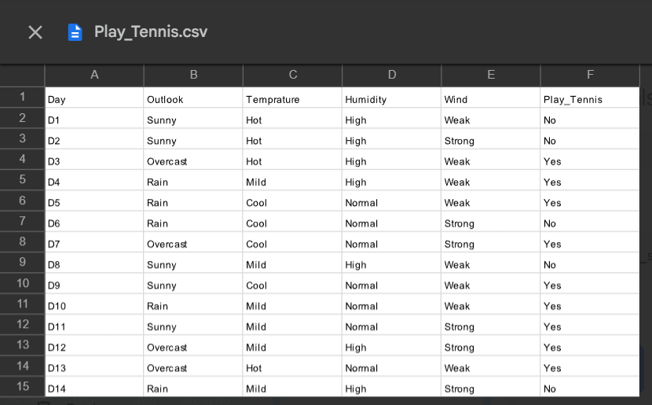
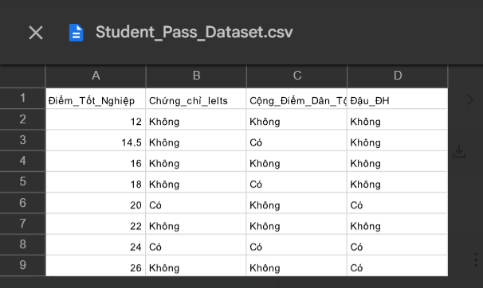
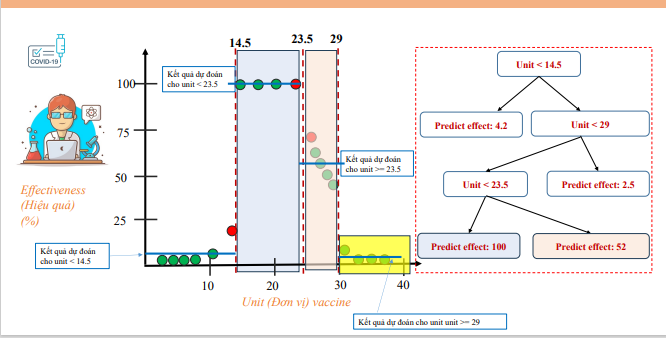
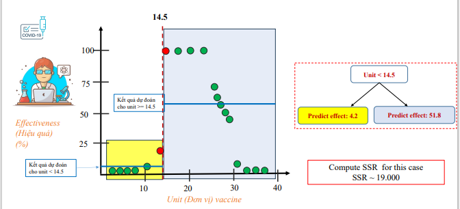
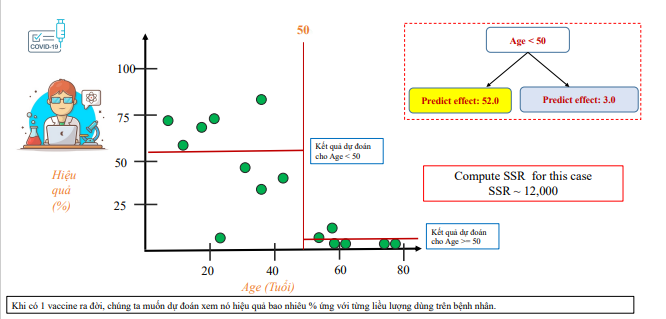
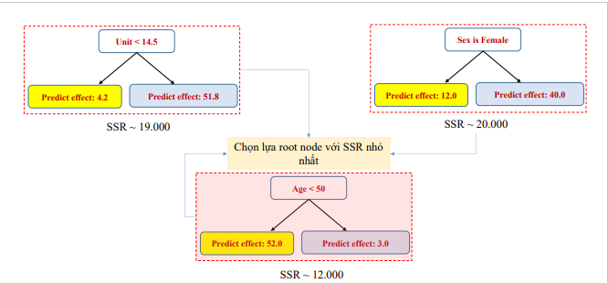

# From Rules to Predictions: A Deep Dive into Decision Tree Algorithms

Have you ever made a decision by working through a series of simple questions? "Is it raining? Yes. Do I have an umbrella? No. Okay, I'll drive." Or perhaps when choosing your morning coffee: "Am I on a diet? Yes. Do I need a big energy boost? Yes. Okay, I'll get an espresso." This intuitive, flowchart-like process of elimination is something we do every day. What if I told you that this very same logic is the foundation for one of the most interpretable and powerful models in machine learning?

Welcome to the world of Decision Trees.

At their core, decision trees are exactly what they sound like: a tree-like model of decisions and their possible consequences. They are the "white box" of machine learning; unlike the opaque inner workings of a neural network, a decision tree's logic is open for all to see. But while a coffee-choosing flowchart is something we design manually, the real magic of machine learning is teaching a computer to build this tree automatically, just by learning from data.

In this deep dive, we'll go on a journey from that simple coffee flowchart to the sophisticated algorithms that power modern machine learning. We'll discover that trees come in two main flavors, each answering a different fundamental question:

*   **Classification Trees**: Answering "What kind is it?" For example, given a student's grades and certifications, will they be admitted to a university? (Yes/No).
*   **Regression Trees**: Answering "How much is it?" For example, given a person's experience level, what is their predicted salary?.

Our mission is to understand not just what these trees do, but how they think. We'll unpack the mathematical engines that drive their decisions, build them from scratch with Python, and tackle the single biggest pitfall—overfitting—that can trip up even the most seasoned practitioners. Let's get started.

## The Art of the Split: How Classification Trees Learn

Imagine you have a dataset of students applying to a university. For each student, you know their graduation score, whether they have an IELTS certificate, and if they get an ethnic minority bonus. The final column tells you if they were admitted ("Đậu đại học"). Our goal is to build a tree that can predict the admission outcome for a new student.

The fundamental challenge is this: at the very beginning, with all this data in one big pile, what is the best first question to ask to split the group? Should we ask about their score? Or their IELTS status? The "best" question is the one that does the best job of separating the "Admitted" students from the "Not Admitted" students, creating two new groups that are more "pure" or "orderly" than the original mixed group.

To do this automatically, the algorithm needs a mathematical way to measure this concept of "purity." Two popular methods dominate this space: Information Gain (using Entropy) and Gini Impurity.

### Measuring Chaos with Entropy and Information Gain

Before we can appreciate order, we must first measure chaos. In information theory, the concept used to measure chaos, uncertainty, or randomness is called **Entropy**.

Let's use an analogy. Imagine a basket of 10 balls, 9 of which are gray and 1 is gold. If you reach in and pull out a gray ball, you're not very surprised. But if you pull out the single gold one, you are very surprised. The "surprise" of an event is inversely related to its probability. Information theory quantifies this surprise as −log₂(p), where p is the probability of the event.

Entropy is simply the average surprise you can expect from a system. It's calculated by taking the surprise of each possible outcome, weighting it by the probability of that outcome, and summing them all up.

The formula for Entropy, H(X), is:
```
H(X) = -Σᵢ₌₁ᶜ pᵢ log₂(pᵢ)
```
where pᵢ is the probability of class i.

A dataset where all samples belong to one class is perfectly orderly. The probability of that class is 1, and the probability of all others is 0. The entropy is 0—there is no surprise or uncertainty. A dataset with a perfect 50/50 split between two classes has the maximum possible entropy of 1.0, because it has the highest average surprise—you are most uncertain about what you'll get.

The algorithm uses entropy to find the best split via a metric called **Information Gain (IG)**. The logic is simple: calculate the entropy of the parent node (the data before the split), then calculate the weighted average entropy of the two child nodes (the data after the split). The Information Gain is the reduction in entropy achieved by the split.

```
IG(S,F) = E(S) - Σ_{f∈F} (|S_f| / |S|) E(S_f)
```
The feature that provides the highest Information Gain is chosen for the split.

### Theory to Practice: The "Play Tennis" Dataset

Let's make this concrete with the classic "Play Tennis" dataset, which has 14 days of weather data and a decision on whether to play tennis ("Yes" or "No").



1.  **Calculate Parent Entropy**: The dataset has 9 "Yes" and 5 "No" outcomes.
    *   P(Yes) = 9/14
    *   P(No) = 5/14
    *   E(S) = -((9/14)log₂(9/14) + (5/14)log₂(5/14)) = 0.940
    This is our starting level of impurity.

2.  **Evaluate a Split on 'Wind'**: The 'Wind' feature can be 'Weak' or 'Strong'.
    *   **Weak Wind**: 8 days total, with 6 'Yes' and 2 'No'.
    *   E(S_Weak) = -((6/8)log₂(6/8) + (2/8)log₂(2/8)) = 0.811
    *   **Strong Wind**: 6 days total, with 3 'Yes' and 3 'No'.
    *   E(S_Strong) = -((3/6)log₂(3/6) + (3/6)log₂(3/6)) = 1.0
    *   **Calculate Information Gain for 'Wind'**:
    *   IG(S, Wind) = 0.940 - [ (8/14) * 0.811 + (6/14) * 1.0 ] = 0.048
    Splitting on 'Wind' reduces our uncertainty by 0.048.

3.  **Compare with Other Features**: The algorithm does this for all features. The slides show the final results:
    *   Gain(S, Outlook) = 0.247 (Note: The slides show 0.226, likely due to a different combination strategy for the three categories, but the conclusion is the same)
    *   Gain(S, Humidity) = 0.151
    *   Gain(S, Wind) = 0.048
    *   Gain(S, Temp) = 0.029

Since 'Outlook' provides the highest Information Gain, it is chosen as the best feature for the root node split. The algorithm then repeats this entire process recursively on the new child nodes until it reaches a stopping point.

### A Faster Alternative: Gini Impurity

While Entropy is grounded in information theory, it can be computationally slower due to the logarithm calculation. An alternative and more common default in libraries like scikit-learn is **Gini Impurity**.

The intuition is more direct: imagine you have a basket of items. You randomly pick one item and then randomly assign it a label according to the distribution of labels in the basket. The Gini Impurity is the probability that you will be wrong.

The formula for Gini Impurity is:
```
G = 1 - Σᵢ₌₁ᶜ pᵢ²
```
The term Σpᵢ² represents the probability of picking an item of class i (with probability pᵢ) and then, after putting it back, picking another item of the same class i (again, with probability pᵢ). Summing this across all classes gives the total probability of picking two items of the same class. Therefore, 1 - Σpᵢ² is the probability of picking two items of different classes—a direct measure of mismatch or impurity. A Gini score of 0 is perfectly pure, while a score of 0.5 indicates maximum impurity for a two-class problem.

The process of using it is identical to Entropy: calculate the Gini Impurity of the parent, calculate the weighted average Gini of the children, and find the split that maximizes the Gini Gain (the reduction in impurity).

### Theory to Practice: The "Student Admission" Case Study

Let's build a tree from scratch using Gini Impurity on our student admission dataset.



1.  **Calculate Root Gini Impurity**: Our dataset has 8 students: 3 admitted ('Có') and 5 not admitted ('Không').
    *   P(Admitted) = 3/8
    *   P(NotAdmitted) = 5/8
    *   G(S₀) = 1 - [(3/8)² + (5/8)²] = 0.4688

2.  **Evaluate Splits to Find the Root Node**:
    *   **Split on 'Chứng chỉ IELTS'**:
        *   Has IELTS ('Có'): 2 students, both Admitted. G_IELTS=Có = 0.
        *   No IELTS ('Không'): 6 students, 1 Admitted, 5 Not Admitted. G_IELTS=Không = 1 - [(1/6)² + (5/6)²] = 0.2778.
        *   Weighted Gini = (2/8 * 0) + (6/8 * 0.2778) = 0.20835.
        *   Gini Gain = 0.4688 - 0.20835 = 0.2604.
    *   **Split on 'Điểm tốt nghiệp < 19'**: (This is the best split point found after testing all midpoints).
        *   Score < 19: 4 students, all Not Admitted. G_Score<19 = 0.
        *   Score >= 19: 4 students, 3 Admitted, 1 Not Admitted. G_Score>=19 = 1 - [(3/4)² + (1/4)²] = 0.375.
        *   Weighted Gini = (4/8 * 0) + (4/8 * 0.375) = 0.1875.
        *   Gini Gain = 0.4688 - 0.1875 = 0.2812.

3.  **Choose the Best Split**: Comparing the Gini Gains, 'Điểm tốt nghiệp < 19' (0.2812) is higher than 'Chứng chỉ IELTS' (0.2604). Therefore, the algorithm chooses the graduation score as the root node split.

This process is then repeated on the new, impure node (the group with scores >= 19) to find the next best split, and so on, until the tree is complete.

### Expert Nuance: Gini vs. Entropy — The 'Gotcha' Moment

A common question for learners is: which metric should I use? The truth is, it rarely makes a big difference. A study comparing the two found that their splitting decisions disagree in only about 2% of cases. However, knowing the subtle differences is a mark of expertise.

| Criterion | Calculation | Computational Cost | Typical Behavior |
| :--- | :--- | :--- | :--- |
| **Gini Impurity** | `1 - Σ(pᵢ²)` | Faster (no logarithms) | Tends to isolate the most frequent class in its own branch. |
| **Information Gain**| `Entropy(parent) - Σwᵢ × Entropy(childᵢ)` | Slower (uses log) | Tends to produce slightly more balanced trees. |

For most practical purposes, Gini Impurity is the default choice due to its speed. But both are powerful tools for quantifying purity and driving the tree-building process.

## Beyond Categories: Predicting Numbers with Regression Trees

So far, we've focused on predicting categories. But what if our target isn't a "Yes/No" answer, but a number, like a salary or a vaccine's effectiveness percentage? This is the domain of **Regression Trees**.

The conceptual leap is realizing that our purity metrics, Gini and Entropy, are now useless. They are built on class probabilities, but with a continuous target, we have an infinite number of "classes." A dataset of salaries [50k, 51k, 52.1k] has no clear groups to measure purity on. We need a new goal.

Instead of maximizing purity, the goal of a regression tree is to **minimize error**. The metric of choice is the **Sum of Squared Residuals (SSR)**, often called Sum of Squared Error (SSE).

Here’s the logic:

1.  For any group of data points (any node in the tree), the prediction is simply the **average** of all the target values in that group.
2.  The SSR is the sum of the squared differences between each individual data point's actual value and that predicted average value.
    ```
    SSR = Σᵢ₌₁ᵐ (Yᵢ - Ŷ_average)²
    ```
3.  The algorithm's job is to find the split (the feature and the threshold) that results in the **lowest possible total SSR** across the two new child nodes.

This reveals a powerful unifying idea: the underlying algorithm for both classification and regression trees is identical. It's a greedy, recursive partitioning process. The only thing that changes is the objective function it's trying to optimize at each step. For classification, it greedily maximizes purity gain; for regression, it greedily minimizes error. This isn't a new algorithm—it's just a new application of the same elegant idea.

### Theory to Practice: The "COVID Vaccine Effectiveness" Walkthrough

Let's use the COVID vaccine effectiveness example to see this in action. We want to predict effectiveness (%) based on features like 'Unit' (dosage), 'Age', and 'Sex'. To find the root node, the algorithm will test all possible splits.









| Feature Split | Left Node Avg. | Right Node Avg. | Total SSR |
| :--- | :--- | :--- | :--- |
| Unit < 14.5 | 4.2% | 51.8% | ~19,000 |
| **Age < 50** | **52.0%** | **3.0%** | **~12,000 (Winner)** |
| Sex is Female | 12.0% | 40.0% | ~20,000 |

As the table shows, the algorithm would perform a brute-force search. It would test splitting on 'Unit' at various thresholds, splitting on 'Age' at various thresholds, and splitting on 'Sex'. For each potential split, it calculates the total SSR. It discovers that splitting the population by Age < 50 results in the largest reduction in error (the lowest total SSR). Therefore, this becomes the rule for the root node. The process then continues, looking for the best possible split within the "Age < 50" group and, separately, within the "Age >= 50" group.

## From Theory to Code: Decision Trees with Scikit-Learn

Now that we've done the hard work of understanding the theory, let's put it into practice with Python's scikit-learn library. This is where we bridge the gap from manual calculations to efficient, real-world implementation.

### Case Study 1: The Student Admission Classifier

Let's build the classifier for the student admission problem we analyzed earlier. The code follows a straightforward pattern: load, prepare, train, and visualize.

```python
import pandas as pd
import numpy as np
import matplotlib.pyplot as plt
from sklearn.tree import DecisionTreeClassifier, plot_tree

# --- 1. Data Loading and Preparation ---
# Assumes 'Student_Pass_Dataset.csv' is in the current directory
df = pd.read_csv(
   'Student_Pass_Dataset.csv',
   names=['Điểm tốt nghiệp', 'Chứng_chỉ_Ielts', 'Diện_ưu_tiên', 'Đậu_ĐH'],
   header=0
)

# Encode categorical features into numbers
df_encoded = df.copy()
bin_map_features = {'Có': 0, 'Không': 1} # 'Có' (Yes) is 0, which goes left in the tree
bin_map_target = {'Có': 1, 'Không': 0}   # 'Có' (Pass) is our positive class

df_encoded['Chứng_chỉ_Ielts'] = df_encoded['Chứng_chỉ_Ielts'].map(bin_map_features)
df_encoded['Diện_ưu_tiên'] = df_encoded['Diện_ưu_tiên'].map(bin_map_features)
df_encoded['Đậu_ĐH'] = df_encoded['Đậu_ĐH'].map(bin_map_target)

# Separate features (X) and target (y)
features = ['Điểm tốt nghiệp', 'Chứng_chỉ_Ielts', 'Diện_ưu_tiên']
X = df_encoded[features]
y = df_encoded['Đậu_ĐH']

# --- 2. Training the Classifier ---
# Instantiate the model. 'gini' is the default but we'll be explicit.
clf = DecisionTreeClassifier(criterion='gini', random_state=0)

# Train the model on our data
clf.fit(X, y)

# --- 3. Visualization ---
plt.figure(figsize=(12, 8))
plot_tree(
   clf,
   feature_names=['Graduation Score', 'IELTS Certificate', 'Priority Bonus'],
   class_names=['Not Admitted', 'Admitted'],
   filled=True,
   rounded=True,
   proportion=False, # Showing counts instead of proportions
   impurity=True,
   fontsize=10
)
plt.title('Student Admission Decision Tree (Gini)')
plt.show()

```

When you run this code, you'll get a beautiful visualization of the decision tree. And what's the very first split at the top? **Graduation Score <= 19.0**. This is the "Aha!" moment where practice confirms theory. The library, using its highly optimized code, arrived at the exact same conclusion we did with our manual Gini Gain calculations. It found the question that most effectively purifies the data.

### Case Study 2: The Salary Predictor Regressor

Now, let's build the regression tree to predict salary based on job level.


```python
import pandas as pd
import numpy as np
import matplotlib.pyplot as plt
from sklearn.tree import DecisionTreeRegressor

# --- 1. Data Loading and Preparation ---
# Manually creating the dataframe from the case study
data = {
   'Level': [1, 2, 3, 4, 5, 6, 7, 8, 9, 10],
   'Salary': [45000, 50000, 60000, 80000, 110000, 150000, 200000, 300000, 500000, 1000000]
}
df_salary = pd.DataFrame(data)

# Reshape X to be a 2D array, as scikit-learn expects
X = df_salary[['Level']]
y = df_salary['Salary']

# --- 2. Training the Regressor ---
regressor = DecisionTreeRegressor(random_state=0)
regressor.fit(X, y)

# --- 3. Visualization ---
# Create a smoother range of X values for a clean plot
X_grid = np.arange(min(X.values), max(X.values), 0.01).reshape(-1, 1)

plt.figure(figsize=(10, 6))
# Plot the original data points
plt.scatter(X, y, color='red', label='Actual Data')
# Plot the regression tree's predictions
plt.plot(X_grid, regressor.predict(X_grid), color='blue', label='Prediction')
plt.title('Salary Prediction with Decision Tree Regression')
plt.xlabel('Position Level')
plt.ylabel('Salary')
plt.legend()
plt.show()

```

The plot generated by this code is revealing. It's not a smooth curve like in linear regression; it's a series of horizontal lines, forming a step-function. This isn't a mistake—it's a direct visual representation of how a regression tree works. The tree partitions the feature space (the 'Level' axis) into distinct regions (the leaves). The prediction for any point within a given region is simply the constant average of the training data points that fell into that same region. For example, any level between 6.5 and 7.5 will be predicted to have a salary of 200,000. Understanding this step-like behavior is key to building the correct intuition for regression trees.

## The Critical Pitfall: Overfitting and the Art of Pruning

We've seen how powerful decision trees can be, but they hide a dangerous trap: **overfitting**.

Imagine a student who crams for a test not by learning the concepts, but by memorizing the exact questions and answers from the study guide. They'll get 100% on a test using those exact questions, but will fail miserably if the questions are slightly different. An unconstrained decision tree does the same thing. If you let it grow to its maximum depth, it will create hyper-specific rules to perfectly classify every single data point in the training set, including any noise or outliers. This model has "memorized" the training data but has failed to learn the general underlying pattern. It will perform poorly on any new, unseen data.

The solution to this problem is **pruning**: strategically cutting back the tree to prevent it from becoming too complex.

### Pre-Pruning (The Simple Fix)

The easiest approach is to stop the tree from growing in the first place. You can set "guardrails" when you create the model. The two most common parameters are:

*   **`max_depth`**: Limits how many levels deep the tree can grow.
*   **`min_samples_leaf`**: Requires a certain number of samples to be present in a leaf node. A split will only be considered if it leaves at least this many samples in each of the resulting child nodes.

These are excellent first-line defenses and are often effective enough for many problems.

### Post-Pruning (The Robust Method): Cost Complexity Pruning

A more sophisticated technique is to grow the full tree first and then prune it back. **Cost Complexity Pruning** provides a systematic way to do this.

The core idea is to define a "Tree Score" that balances prediction error with model complexity. The formula is:

`TreeScore = SSR + αT`

*   **SSR** is the Sum of Squared Residuals (the total error).
*   **T** is the number of terminal nodes (leaves) in the tree (the complexity).
*   **α (alpha)** is a complexity parameter that we control.

You can think of alpha as a "complexity tax." For any branch to be considered "worth keeping," the error reduction it provides (the drop in SSR) must be greater than the tax (alpha) it costs to add that leaf. If you set a high tax, only splits that provide a massive improvement in accuracy will be kept. The algorithm prunes away any branches that don't "pay for themselves" in terms of error reduction.

The process involves generating a series of pruned trees for different values of alpha. We then use cross-validation to find which alpha (and its corresponding pruned tree) performs the best on unseen data. This method finds a robust balance between fitting the data well (low bias) and keeping the model simple enough to generalize (low variance).

## Key Takeaways & Final Thoughts

As I journeyed through this week's material, my biggest "Aha!" moment was the realization that classification and regression trees, which seem to solve very different problems, are driven by the exact same elegant, greedy, recursive algorithm. The only difference lies in the objective function they are trying to optimize at each step. This unifying principle is a beautiful example of the foundational ideas in machine learning.

Here's a summary of what we've learned:

*   **Decision Trees** are intuitive, flowchart-like models for both classification ("what kind?") and regression ("how much?").
*   **Classification trees** use Gini Impurity or Information Gain to find splits that create the "purest" possible leaf nodes.
*   **Regression trees** use Sum of Squared Residuals (SSR) to find splits that minimize the prediction error in the leaf nodes.
*   **Overfitting** is the biggest danger. You can control it with simple pre-pruning (e.g., setting `max_depth`) or the more robust post-pruning method of Cost Complexity Pruning.

We've traveled from a simple decision about coffee to the mathematical core of how machines learn to make rules, and finally to building and refining these models in code. Decision Trees are not just powerful on their own; they are the fundamental building block for some of the most dominant algorithms in modern machine learning, like Random Forests and Gradient Boosted Trees.

